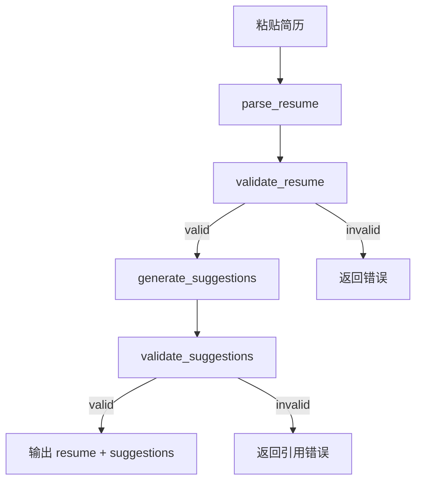
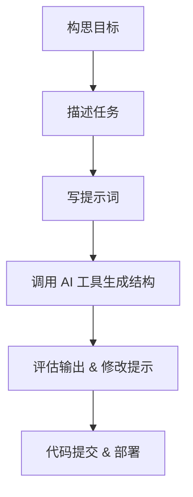

## Slide 1: 课程封面

**标题**：AI驱动下的软件项目实践：JobPrep

**副标题**：从需求到上线，如何借助AI构建智能求职助手

**作者/讲师**：Ben Yue

**Logo / 插图**：JobPrep 项目 Logo 或关键界面截图

---

## Slide 2: 课程目标

- 理解 AI 驱动软件开发的新范式
- 掌握通过提示词协作完成项目的基本方法
- 学会从 0 到 1 驱动一个 Agent 项目的落地
- 体验 LangGraph、FastAPI、Next.js 的协作流程
- 将提示词作为核心交互工具，培养 AI 使用思维

---

## Slide 3: 课程结构

本课程共 60 页，分为以下模块：

1. 项目背景与理念（1–10）
2. JobPrep 项目介绍与架构（11–20）
3. 提示词驱动开发流程详解（21–45）
4. 部署与测试（46–50）
5. 方法论总结与思维迁移（51–60）

---

## Slide 4: 新的范式：Code is Cheap

传统观念：

- 手写代码是价值体现
- 架构先行，设计文档优先

AI 驱动下的新范式：

- 提示词是“新编程语言”
- 代码由提示词自动生成
- 架构与实现融合推进

核心信条：Code is cheap, show me the talk

---

## Slide 5: 新范式下的开发流程

1. 明确目标 → 通过提示词描述目标
2. 与 AI 工具协作生成代码 / 架构 / API
3. 实时验证和部署，快速调整
4. 所有开发动作可重现（prompt + tag）

⚠️ 不再是写代码，而是构建 AI 协作脚本

---

## Slide 6: 提示词编程 vs 传统编程

|            | 传统编程         | 提示词编程            |
|------------|------------------|------------------------|
| 输入       | 代码             | 自然语言提示词         |
| 输出       | 功能实现         | 自动生成的架构/代码     |
| 调试       | 打断点、log      | 修改提示词             |
| 积累       | Git 版本         | Prompt + Tag           |
| 技能核心   | 语法与框架       | 问题建模与结构化表达     |

---

## Slide 7: JobPrep 项目简介

JobPrep 是一个面向应聘者的智能简历完善与交互平台，核心目标是：

- 帮助用户通过粘贴文本快速构建结构化简历
- 利用 AI Agent 提供个性化优化建议
- 通过聊天方式逐步完善简历与求职档案
- 支持真实项目部署，完整体验后端 + 前端 + AI 协作流程

---

## Slide 8: JobPrep 的用户体验

1. 粘贴文本，快速生成结构化简历
2. 自动识别缺失信息，生成优化建议
3. 用户在结构化视图与 Chat 中交互改进内容
4. 支持“接受建议”与“引用内容”操作
5. 后端 Agent 通过 LangGraph 逐步引导完善

---

## Slide 9: 系统架构总览

```text
User ↔ Next.js UI
        ↕
     API Routes (Next.js)
        ↕
     FastAPI LangGraph Agent
        ↕
     DashScope Embedding & LLM
        ↕
     Chroma Vector Store
```

- 前端：Next.js + Tailwind
- 后端：FastAPI + LangGraph
- 模型：DashScope qwen-turbo / embedding

---

## Slide 10: 数据架构视图

- 用户数据：结构化简历 + 聊天记录
- 数据流动路径：
  - 粘贴简历 → POST /api/parse_resume
  - 返回结构 resume + suggestions
  - GET /api/resume 用于显示 resume
  - POST /api/chat 支持 Chat 驱动改进

---

## Slide 11: 功能拆解：简历上传与解析

**目标功能：**

- 用户上传简历文本（TXT/Markdown）
- 后端用 LangGraph 分两步处理：
  1. 提取结构化简历数据（resume）
  2. 生成优化建议（suggestions）

**提示词任务设计：**

- prompt1：提取简历结构（JSON）
- prompt2：基于结构给出改进建议

---

## Slide 12: LangGraph 流程图



---

## Slide 13: 后端 FastAPI 接口设计

- `POST /api/parse_resume`
  - 输入：{ text: string }
  - 输出：{ resume: Resume, suggestions: Suggestion[] }

- `GET /api/resume`
  - 输出当前用户的结构化简历（可为空）

- `PATCH /api/resume`
  - 接受某条建议，修改简历内容

---

## Slide 14: 提示词：生成结构化简历

你是一位专业的简历分析师，请从以下文本中提取出结构化简历数据，包含字段：

- 基本信息（姓名、邮箱、电话、LinkedIn）
- 教育经历（学校、学位、专业、时间）
- 工作经历（公司、职位、时间、描述）
- 技能列表
- 项目经验（如有）

输出格式为 JSON。

---

## Slide 15: 提示词：生成建议

请基于以下 resume 内容，为用户提供优化建议：

1. 指出缺失或不完整的内容
2. 提高简历表达（如：量化成果、改进动词）
3. 建议突出与岗位相关的内容

建议输出格式：

- text: 建议内容
- reference: 关联的 resume 字段（如 education[1]）

---

## Slide 16: 前端流程总览

1. `/upload` 页面粘贴简历
2. POST `/api/parse_resume` 分析结构
3. 成功后跳转 `/edit`
4. `/edit` 页面显示 resume + suggestions
5. 用户点击 suggestion 可触发 PATCH `/api/resume`
6. 右侧 Chat 窗口可引用字段与建议进行交互

---

## Slide 17: upload 页面设计

- 页面路径：`/upload`
- 元素：
  - `<textarea>` 粘贴框
  - “确认分析”按钮
- 技术点：
  - fetch POST /api/parse_resume
  - useState 控制 loading 状态
  - 成功跳转 /edit

---

## Slide 18: edit 页面设计

- 页面路径：`/edit`
- useEffect 获取 resume 内容
- 左侧：resume JSON 结构显示（初期）
- 右侧：chat 组件，支持引用 resume 字段
- 后续支持逐项渲染与“接受建议”功能

---

## Slide 19: Chat 窗口设计

**功能目标：**

- 用户向 AI 提问，获取简历优化帮助
- 可引用 resume 字段 / 建议内容
- 后端 LangGraph Agent 驱动对话流程
- Chat 结果可转为 PATCH 请求

**交互样式：**

- Message + 引用标签（如：🔗 experience[2]）

---

## Slide 20: 路由跳转逻辑

- 首页逻辑：
  - `GET /api/resume`
  - 若 resume 为空，跳转 `/upload`
  - 否则跳转 `/edit`

- `/test` 页面保留原始页面测试内容

- 所有页面使用 Tailwind + React Hook 管理状态

---

## Slide 21: 开发起点：Starter Repo 使用方法

- 仓库地址：<https://github.com/benyue1978/learn_agent_jobprep>

**学员操作：**

1. `git clone` 仓库后 checkout 到 `v0.1` tag
2. 删除 `.git` 文件夹：`rm -rf .git`
3. 初始化自己的仓库：`git init && git remote add origin ...`
4. 根据提示词逐步推进开发

---

## Slide 22: Tag 划分策略

每一步实现都对应一个 Git Tag，方便教学与回退：

- `v0.1`: 最小 starter 项目
- `v0.2`: 上传页面实现
- `v0.3`: resume 接口联通
- `v0.4`: /edit 页面基本完成
- `v0.5`: 引入 LangGraph Agent

---

## Slide 23: 部署策略

- 前端部署：Vercel（Next.js 项目直接一键部署）
- 后端部署：Render.com（FastAPI 可部署为Web Service）
- 环境变量配置：
  - DashScope Key
  - 前端 CORS 允许后端地址

---

## Slide 24: 测试策略

- 使用 `@playwright/mcp` 自动生成测试脚本
- MCP server 配置于 `package.json`
- 命令：`pnpm run test`

**提示词范例：**

```text
请帮我写一个 Playwright 测试脚本，打开 /upload 页面，粘贴文本，点击按钮，断言跳转到 /edit
```

---

## Slide 25: 总结：项目设计小结

我们已经完成了 JobPrep 的整体功能规划：

- 简历上传 → 结构化分析 → 优化建议
- Chat 驱动逐步完善
- 后端 LangGraph 保持流程可控与可扩展
- 前端保持最小而完整的交互流程

接下来：进入方法论与提示词实践环节

---

## Slide 26: Prompt Engineering 核心理念

- AI 就像一个“专家团队”，提示词决定你能召唤出哪位专家。
- 高质量提示词具备 3 个要素：
  - 目标清晰：告诉 AI “要做什么”
  - 角色明确：告诉 AI “你是谁”
  - 输入明确：提供完整上下文信息
- 示例：
  > 你是一个资深的招聘顾问，请帮我根据以下简历给出改进建议。

---

## Slide 27: 提示词类型与结构化设计方法

### 常见提示词类型

- 操作型：让 AI 执行具体任务
- 引导型：分步骤引导生成内容
- 批判型：让 AI 帮忙检查或挑战观点

### 推荐结构

```text
你是 [角色]，
请帮我完成 [任务]，
输入如下：[输入内容]，
请输出 [期望格式]。
```

---

## Slide 28: 在 JobPrep 中的提示词实践场景

- 上传简历时提示词：
  > 你是一个结构化简历分析师，请将下方简历文本解析为 resume JSON 格式…

- Chat 页面建议生成：
  > 你是我的求职教练，请根据以下 resume 提出 3 条优化建议，输出 JSON 格式。

- Prompt chaining：将提示词嵌套在 Agent 流程中，支持调试与验证。

---

## Slide 29: LangGraph 的提示词设计原则

- 每个 Node 只处理一个“任务原子”
- Prompt 是 Node 的“接口文档”，需清晰定义输入输出
- 对于失败节点，可以提供 `retry_prompt` 或调试提示
- 示例节点：validate_resume
  > 请验证以下 resume 是否符合 schema，返回字段缺失项列表

---

## Slide 30: LangGraph 中的结构化信息提取流程

- **问题背景**：
  - 从用户粘贴的纯文本简历中，提取结构化 JSON 数据。
  - LLM 本身并不能保证输出符合结构要求，容易缺字段或格式错误。

- **解决方案**：
  1. **One-shot Prompt 设计**：
     - 提供一个简历文本 + 一个完整 JSON 示例，要求模型严格按格式输出。
     - 提示词中强调：不要输出额外内容，只返回 JSON。
  2. **Schema 校验与重试**：
     - 使用 Pydantic 定义结构化简历的 schema。
     - LangGraph 中通过校验节点（validate_resume）判断结构是否完整。
     - 若失败，自动提示模型重试（带错误信息反馈）。

- **LangGraph 节点流程图**（简化）：

  ```mermaid
  graph TD
    A[简历文本输入] --> B[LLM 输出 resume JSON]
    B --> C[本地 schema 校验]
    C -->|通过| D[生成建议]
    C -->|失败| E[带错误信息反馈，LLM 重试]
  ```

---

## Slide 31: AI 驱动开发流程的变化

> Code is cheap. Show me the talk.

- 传统开发：写代码是核心产出
- AI时代：思考、表达、设计才是稀缺资源
- 编码工作可交给 AI 或低代码系统完成

### 转变的三个关键词

- from 工具使用 → 合作对话
- from 手写细节 → 提示意图
- from 实现为王 → 流程为王

---

## Slide 32: 提示词与系统协同的范式

| 要素         | 传统方式                | AI 协同方式            |
|--------------|-------------------------|------------------------|
| 功能需求     | 写 PRD                  | 用提示词驱动 AI 生成  |
| 代码实现     | 手写/复制粘贴           | AI 生成，人工审校      |
| 流程控制     | 手工维护状态            | Agent 自动流转         |
| UI交互       | UI → 请求 → 响应        | 对话中逐步完善         |

---

## Slide 33: 用户视角：体验路径与行为引导

- 用户进入系统后：
  1. 上传简历（自由粘贴）
  2. 自动分析生成结构化简历 + 建议
  3. 结构化展示 + Chat 引导修改
  4. 用户确认、接受建议或补充信息
- 每一步都有提示词引导 + LLM 理解

---

## Slide 34: 学员视角：如何与 AI 配合完成项目

- 不要求你手写所有代码
- 学会用提示词对 AI 下达任务：
  - 设计页面结构
  - 修改前端行为
  - 写后端 API 模拟数据
- 提交前，需审阅 AI 输出，确保逻辑正确、代码合规

---

## Slide 35: 示例：从提示词出发设计一个页面

### 目标：创建 Upload 页面

提示词设计如下：

```text
你是一个前端开发助手，请帮我在现有的 Next.js 项目中添加一个路径为 /upload 的页面…
```

☑️ 页面元素、交互行为、fetch 请求、跳转逻辑全部由 AI 生成

---

## Slide 36: 学员任务拆解（阶段1）

### 第一阶段任务：本地运行 + 初步开发

- 使用 starter 项目（GitHub）
- Checkout 到 tag：`v0-upload-ready`
- 删除 `.git` 并初始化新仓库
- 完成以下功能：
  - ✅ /upload 页面
  - ✅ 调用后端 `/parse_resume`
  - ✅ GET /resume 跳转逻辑
  - ✅ /edit 页面初始搭建

---

## Slide 37: 学员任务拆解（阶段2）

### 第二阶段任务：增强结构化展示

- 使用 `<ResumePanel />` 显示 resume 各部分
- 嵌入建议区域 `<Suggestions />`
- 点击“接受建议”后调用 API 修改 resume
- UI 组件可用 AI 帮忙生成，但需根据提示词精调样式与交互逻辑

---

## Slide 38: 学员任务拆解（阶段3）

### 第三阶段任务：接入 Chat 窗口与 AI 协作

- 使用 `<ChatPanel />` 实现对话视图
- 支持引用 resume 某段内容
- 与 AI 对话完善某项字段（如某段工作经历）
- 对话建议中提供一键“应用”按钮，自动调用 API 更新

---

## Slide 39: 项目交付标准

每位学员最终提交以下内容：

- 🌐 一个部署好的网站（可用 Vercel + Render）
- 🗂️ 一个 GitHub 项目，包含清晰提交记录
- 📝 一份总结文档，说明你使用了哪些提示词解决了什么问题
- ✅ 项目符合三个核心模块：
  - 简历上传与分析
  - 结构化编辑与建议
  - Chat 驱动完善

---

## Slide 40: 常见误区与反模式

❌ 提示词太短或不完整

❌ 完全依赖 AI 输出，不理解代码含义

❌ 忽视接口协议与真实后端行为

✅ 最佳实践：

- 将提示词写成“小项目说明书”
- 把复杂任务分解为多轮提示词
- 加入测试与验证，确保行为可靠

---

## Slide 41: 提示词进阶技巧

1. 模板化：
   - 抽象出多个“通用提示词模板”
   - 在项目不同环节复用

2. 加入测试上下文：
   - 明确输入/输出结构
   - 如：
     > 请返回 JSON 格式，其中包含 resume 字段和 suggestions 字段

3. 多轮精调：
   - 提示词 → 输出不满意 → 优化提示词 → 再试

---

## Slide 42: 什么是“Show Me the Talk”范式？

- “Code is cheap” 不是否定编码，而是强调：
  - 结构设计、上下文表达、团队协作、意图沟通，比代码本身更关键。
- “Talk” 是 Prompt、是架构文档、是LangGraph、是交互流程。
- AI 时代的软件工程是 Prompt-Driven，而不是 Code-Driven。

---

## Slide 43: 从 Talk 到 Code 的新流程



- 每一步都能通过 Talk 驱动，而不是直接手写代码。

---

## Slide 44: Prompt 是什么？

- Prompt 是人与 AI 之间的“系统接口”
- 一条好的 Prompt 应该具备：
  - 背景清晰
  - 目标明确
  - 上下文充分
  - 输出规范

---

## Slide 45: Prompt 结构化模板

```md
你是一个 [角色]，请帮我完成 [目标]。

## 背景
简要说明业务背景或问题场景。

## 要求
- 明确功能目标
- 指定输入输出格式
- 限定使用工具或方法
```

---

## Slide 46: Prompt 实践案例 - Upload 页面

- 背景：我需要一个用户粘贴简历的页面
- Prompt：

```md
你是一个前端开发助手，请在 Next.js 中创建一个页面 /upload，包含文本框、按钮，点击调用 API /parse_resume，成功后跳转 /edit。
```

---

## Slide 47: Prompt 实践案例 - LangGraph 工作流

- 背景：我想把简历解析流程设计为 LangGraph
- Prompt：

```md
你是一个 LangGraph 工程师，请画出 parse_resume 的 Graph，包括文本解析、结构校验、建议生成与验证，并用 Mermaid 表达。
```

---

## Slide 48: Prompt 实践案例 - 撰写 README

- 背景：我希望用户了解项目结构和用法
- Prompt：

```md
你是一个文档专家，请为一个 FastAPI + Next.js 项目生成 README，包含运行方式、主要功能和目录结构说明。
```

---

## Slide 49: 如何构建自己的 Prompt Cheatsheet？

- 记录自己常用的提示词模式
- 每个角色准备一个模板（如后端、前端、测试、产品）
- 随项目不断精炼：从“试探型”走向“规范型”
- 推荐工具：Notion、Obsidian、Markdown 文件夹

---

## Slide 50: 工程结构与提示词协同演进

- 项目目录 + Prompt 文件配对维护
  - `/frontend/upload/page.tsx` → `prompt/upload_prompt.md`
- 每个功能分支写清楚“我是如何通过提示词生成这个页面的”
- 最终实现 Prompt-Driven Git 历史

---

## Slide 51: AI + 工程师的协作定位

| 能力维度       | 人类工程师             | AI 助手                     |
|----------------|------------------------|------------------------------|
| 目标理解       | ✅ 强                   | ⚠️ 依赖上下文               |
| 代码生成       | ✅ 有经验但速度较慢     | ✅ 极速生成组件和结构       |
| 架构设计       | ✅ 抽象与拆解能力强     | ⚠️ 需引导                   |
| 沟通表达       | ✅ 业务语言沟通清晰     | ❌ 不能替代跨人沟通         |
| 重复劳动       | ❌ 易疲劳               | ✅ 无限精力                 |

---

## Slide 52: JobPrep 项目的意义

- 不只是一个“简历填写工具”
- 而是一次完整的 Prompt-Driven Project 实战
  - 需求分析
  - 架构建模
  - 前后端联调
  - Chat UI 与 AI 协作流程设计

---

## Slide 53: 给学员的建议：从“追随代码”到“引导 AI”

- 不要从“我该写什么代码”出发
- 转为“我该如何描述问题”
- 让 AI 为你编码、生成、测试、重构

---

## Slide 54: 如何用 JobPrep 开启自己的项目？

1. Clone starter 仓库
2. Checkout 到 tag，例如：`git checkout tags/lesson-1`
3. 删除 `.git` 并初始化新的 repo
4. 在 Notion / Obsidian 里开一个 Prompt 日志文档
5. 每次改动前先写提示词，然后调用 Cursor / ChatGPT 实现

---

## Slide 55: 提示词驱动的协作开发实践

- 学员 A：负责上传页与前端样式
- 学员 B：设计 LangGraph 流程并生成 API
- 学员 C：聚焦 resume 建模与验证
- 所有产出都必须附带 Prompt

---

## Slide 56: 展望进阶：插件与自动化

- 用 AI 生成和测试 Playwright 脚本
- LangGraph 流程可视化 + 管理面板
- 与 Supabase / Notion / Vercel 联动
- 自研 Prompt 版本控制系统

---

## Slide 57: 我们的愿景

- 每个程序员都能训练自己的 AI 工作流
- 每一个 AI 项目都应该有完整的 Prompt 脚本和版本记录
- 学会“Show Me the Talk”= 掌握 AI 时代的生产力核心

---

## Slide 58: 总结回顾

- 项目介绍：JobPrep = Prompt-Driven AI 实战
- 方法论：Prompt 是新接口，LangGraph 是新架构
- 实践技巧：提示词模板、Mermaid、结构校验
- 成果标准：能跑起来，不如能讲明白

---

## Slide 59: 练习与扩展任务建议

- 给 edit 页面添加 resume 分区编辑器
- 增加建议接受后更新 resume 的功能
- 为 chat 增加引用简历字段的功能
- 写一个新的 Prompt 生成 playright 测试
