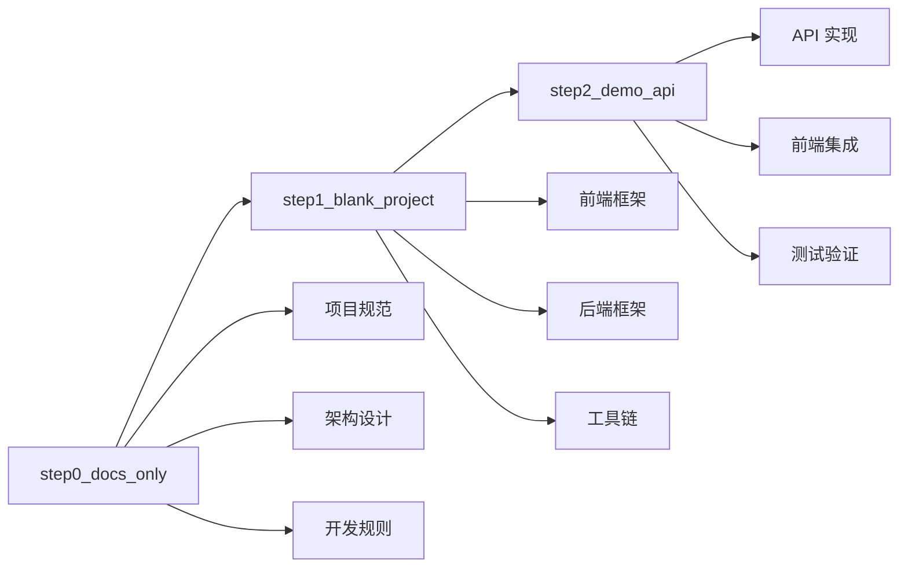

# JobPrep 项目 Tag 历史

本文档记录了 JobPrep 项目的所有 Git Tag 及其对应的功能特性。

## Tag 列表

### 🏷️ step0_docs_only

**提交**: `47c10399d9aa76229ea126672c93a992fdef7ffa`
**日期**: 2025-07-17 18:42:29+08:00
**描述**: 项目文档和规则初始化

#### 功能特性

- ✅ 项目架构文档 (`system_architecture.md`)
- ✅ 数据架构设计 (`data_architecture.md`)
- ✅ 用户旅程设计 (`user_journey.md`)
- ✅ 任务分解 (`task_breakdown.md`)
- ✅ 课程准备指南 (`class_preparation.md`)
- ✅ Cursor IDE 规则配置
  - 后端规则 (`backend.mdc`)
  - 前端规则 (`frontend.mdc`)
  - 部署规则 (`deploy.mdc`)
  - 项目结构规则 (`project.mdc`)

#### 技术规范

- 定义了完整的项目架构
- 建立了开发规范和最佳实践
- 配置了 Cursor IDE 智能提示规则

---

### 🏷️ step1_blank_project

**提交**: `8035109b427913b889bc7931575dbea3ce8dc7c9`
**日期**: 2025-07-17 23:14:20+08:00
**描述**: 初始化空白的前后端项目结构

#### 项目功能

- ✅ 前端项目初始化 (Next.js 15)
  - TypeScript 配置
  - Tailwind CSS v4
  - shadcn/ui 组件库
  - ESLint 配置
- ✅ 后端项目初始化 (FastAPI)
  - Python 虚拟环境
  - 基础依赖配置
  - 项目结构创建
- ✅ Monorepo 配置
  - pnpm workspace
  - 统一脚本管理
- ✅ CI/CD 配置
  - GitHub Actions 工作流
- ✅ 开发脚本
  - 跨平台启动脚本
  - 自动化初始化脚本

#### 技术栈

- **前端**: Next.js 15, TypeScript, Tailwind CSS, shadcn/ui
- **后端**: FastAPI, Python, uvicorn
- **工具**: pnpm, ESLint, GitHub Actions

---

### 🏷️ step2_demo_api

**提交**: `223db2c4408ff8959ccf048eb9b08dd28ab592ab`
**日期**: 2025-07-18 09:43:19+08:00
**描述**: 添加演示 API 和前后端集成

#### API 功能

- ✅ 后端 API 实现
  - FastAPI 应用框架
  - CORS 跨域支持
  - `/test` 端点 (返回 "Backend is up and running")
  - `/healthz` 健康检查端点
  - API 文档自动生成 (Swagger UI)
  - 单元测试覆盖
- ✅ 前端测试页面
  - 后端连接测试组件
  - 实时状态显示
  - 错误处理机制
  - 响应式设计
- ✅ API 客户端
  - Axios 封装
  - TypeScript 类型定义
  - 环境变量配置
- ✅ 完整文档
  - 后端 README
  - 前端 README
  - 使用说明和示例

#### 技术特性

- **后端**: FastAPI, CORS, pytest, 环境变量管理
- **前端**: React hooks, Axios, Tailwind CSS, 错误处理
- **集成**: 前后端通信, 类型安全, 自动化测试

---

## 版本演进



## 使用指南

### 检出特定版本

```bash
# 查看所有 tag
git tag -l

# 检出特定版本
git checkout step2_demo_api

# 创建新分支基于特定 tag
git checkout -b feature/new-feature step2_demo_api
```

### 版本对比

```bash
# 比较两个版本
git diff step1_blank_project..step2_demo_api

# 查看特定版本的变更
git show step2_demo_api
```

## 下一步计划

基于当前 `step2_demo_api` 版本，后续可以继续开发：

1. **简历解析功能** - 集成 DashScope LLM
2. **JD 匹配分析** - 智能匹配算法
3. **用户界面优化** - 更丰富的 UI 组件
4. **数据持久化** - 数据库集成
5. **部署配置** - 生产环境部署

每个新功能都可以创建新的 tag 来标记重要的开发里程碑。
