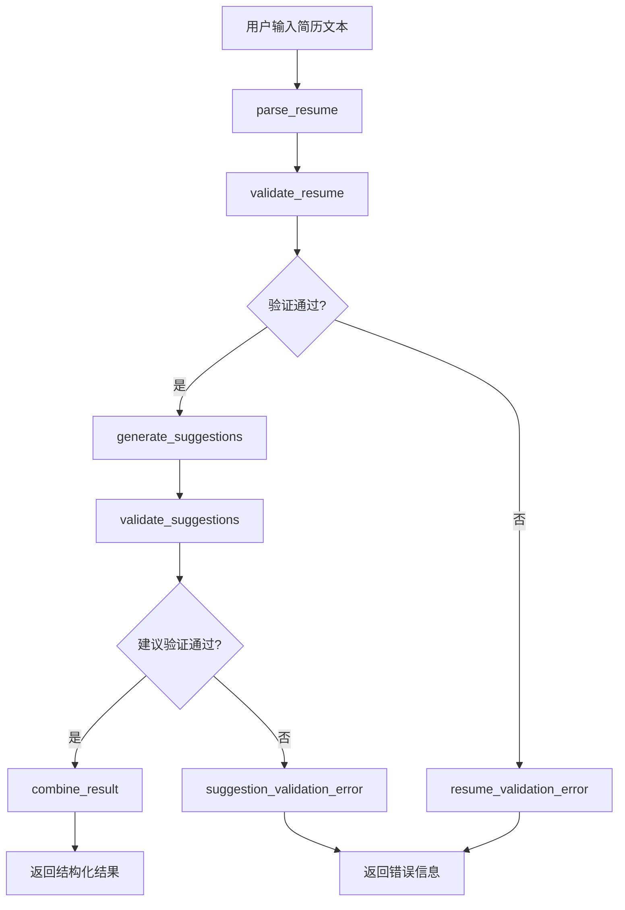
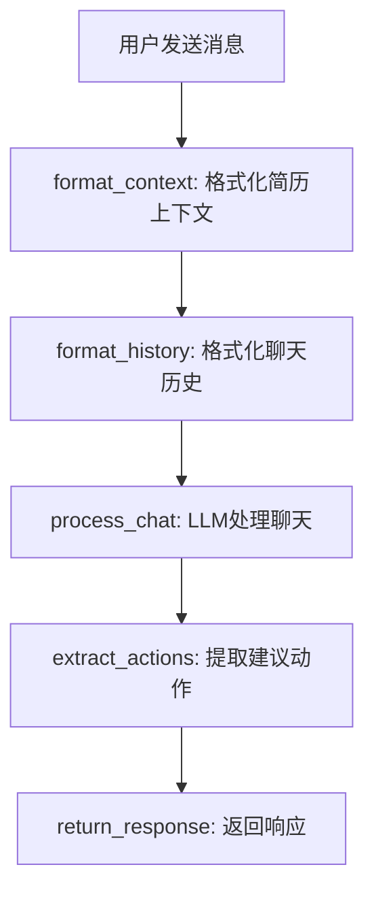
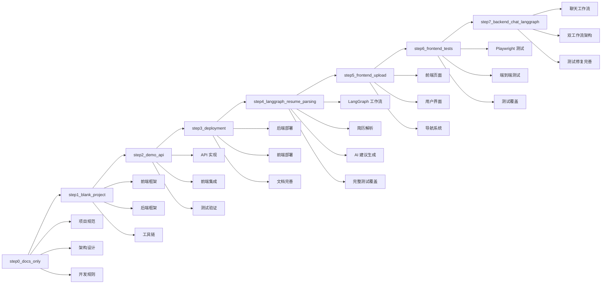

# JobPrep 项目 Tag 历史

本文档记录了 JobPrep 项目的所有 Git Tag 及其对应的功能特性。

## Tag 列表

### 🏷️ step0_docs_only

**提交**: `47c10399d9aa76229ea126672c93a992fdef7ffa`
**日期**: 2025-07-17 18:42:29+08:00
**描述**: 项目文档和规则初始化

#### 功能特性

- ✅ 项目架构文档 (`system_architecture.md`)
- ✅ 数据架构设计 (`data_architecture.md`)
- ✅ 用户旅程设计 (`user_journey.md`)
- ✅ 任务分解 (`task_breakdown.md`)
- ✅ 课程准备指南 (`class_preparation.md`)
- ✅ Cursor IDE 规则配置
  - 后端规则 (`backend.mdc`)
  - 前端规则 (`frontend.mdc`)
  - 部署规则 (`deploy.mdc`)
  - 项目结构规则 (`project.mdc`)

#### 技术规范

- 定义了完整的项目架构
- 建立了开发规范和最佳实践
- 配置了 Cursor IDE 智能提示规则

---

### 🏷️ step1_blank_project

**提交**: `8035109b427913b889bc7931575dbea3ce8dc7c9`
**日期**: 2025-07-17 23:14:20+08:00
**描述**: 初始化空白的前后端项目结构

#### 项目功能

- ✅ 前端项目初始化 (Next.js 15)
  - TypeScript 配置
  - Tailwind CSS v4
  - shadcn/ui 组件库
  - ESLint 配置
- ✅ 后端项目初始化 (FastAPI)
  - Python 虚拟环境
  - 基础依赖配置
  - 项目结构创建
- ✅ Monorepo 配置
  - pnpm workspace
  - 统一脚本管理
- ✅ CI/CD 配置
  - GitHub Actions 工作流
- ✅ 开发脚本
  - 跨平台启动脚本
  - 自动化初始化脚本

#### 技术栈

- **前端**: Next.js 15, TypeScript, Tailwind CSS, shadcn/ui
- **后端**: FastAPI, Python, uvicorn
- **工具**: pnpm, ESLint, GitHub Actions

---

### 🏷️ step2_demo_api

**提交**: `223db2c4408ff8959ccf048eb9b08dd28ab592ab`
**日期**: 2025-07-18 09:43:19+08:00
**描述**: 添加演示 API 和前后端集成

#### API 功能

- ✅ 后端 API 实现
  - FastAPI 应用框架
  - CORS 跨域支持
  - `/test` 端点 (返回 "Backend is up and running")
  - `/healthz` 健康检查端点
  - API 文档自动生成 (Swagger UI)
  - 单元测试覆盖
- ✅ 前端测试页面
  - 后端连接测试组件
  - 实时状态显示
  - 错误处理机制
  - 响应式设计
- ✅ API 客户端
  - Axios 封装
  - TypeScript 类型定义
  - 环境变量配置
- ✅ 完整文档
  - 后端 README
  - 前端 README
  - 使用说明和示例

#### 技术特性

- **后端**: FastAPI, CORS, pytest, 环境变量管理
- **前端**: React hooks, Axios, Tailwind CSS, 错误处理
- **集成**: 前后端通信, 类型安全, 自动化测试

---

### 🏷️ step3_deployment

**提交**: `dda535e9d0126c053a686ae0b434b3b200b1d8e4`
**日期**: 2025-07-18 14:20:21+08:00
**描述**: 部署配置和文档完善

#### 部署功能

- ✅ 后端部署配置 (Render.com)
  - Render.com Dashboard 部署
  - 环境变量配置
  - 健康检查端点
  - 自动部署触发
- ✅ 前端部署配置 (Vercel)
  - GitHub Actions 自动部署工作流
  - Vercel 项目配置和集成
  - 环境变量管理 (GitHub Secrets)
  - 构建优化和错误处理
- ✅ 部署文档完善
  - 详细的部署指南 (`DEPLOYMENT.md`)
  - 故障排除说明
  - 配置步骤详解
  - 前后端连接说明
- ✅ 架构更新
  - 从 Fly.io 迁移到 Render.com
  - 更新所有相关文档
  - 修改 Cursor IDE 规则
  - 完善项目配置

#### 部署特性

- **后端部署**: Render.com Dashboard, 环境变量管理
- **前端部署**: GitHub Actions, Vercel, 自动构建
- **文档**: 完整的部署指南, 故障排除, 最佳实践
- **集成**: 前后端自动部署, 环境变量同步

---

### 🏷️ step4_langgraph_resume_parsing

**提交**: `4f891f47946a346bf72f272b2cd257a48a5ebbbb`
**日期**: 2025-07-19 11:58:57+08:00
**描述**: LangGraph 驱动的简历解析功能实现

#### 核心功能

- ✅ LangGraph 工作流实现
  - 简历解析节点 (`parse_resume`)
  - 简历验证节点 (`validate_resume`)
  - 建议生成节点 (`generate_suggestions`)
  - 建议验证节点 (`validate_suggestions`)
  - 结果合并节点 (`combine_result`)
  - 错误处理节点和条件边
- ✅ 数据模型设计 (Pydantic V2)
  - 简历数据结构 (`Resume`)
  - 优化建议模型 (`Suggestion`)
  - 聊天消息模型 (`ChatMessage`)
  - LangGraph 状态模型 (`LangGraphState`)
  - 字段验证和类型安全
- ✅ Mock LLM 客户端
  - 模拟 DashScope/OpenAI API 响应
  - 简历解析接口 (`parse_resume`)
  - 建议生成接口 (`generate_suggestions`)
  - 聊天接口 (`chat`)
- ✅ API 端点实现
  - `/parse_resume` - 简历解析主接口
  - `/resume` - 获取当前简历
  - `/resume/accept-suggestion` - 接受优化建议
  - `/chat` - 简历相关聊天
  - 内存存储和会话管理
- ✅ 服务层实现
  - 简历服务 (`ResumeService`)
  - 聊天服务 (`ChatService`)
  - 字段路径解析和更新
  - 建议接受逻辑
- ✅ 完整测试覆盖
  - 字段解析单元测试
  - 服务层逻辑测试
  - LangGraph 工作流测试
  - API 集成测试
  - 47个测试用例全部通过

#### 技术架构

- **LangGraph**: 状态管理工作流, 条件边控制, 错误处理
- **FastAPI**: RESTful API, 自动文档生成, 类型验证
- **Pydantic V2**: 数据验证, 类型安全, 模型序列化
- **测试**: 分层测试策略, 单元测试到集成测试
- **架构**: 清晰的分层架构, 职责分离, 可扩展设计

#### 工作流程



---

### 🏷️ step5_frontend_upload

**提交**: `f1b2d0a445b880ba670f385ee6d6380b55b0a4d7`
**日期**: 2025-07-20 16:34:44+08:00
**描述**: 前端上传页面和用户界面实现

#### 前端功能

- ✅ 页面路由和导航
  - 首页 (`/`) - 简历状态检查和重定向
  - 上传页面 (`/upload`) - 简历文本输入和解析
  - 编辑页面 (`/edit`) - 结构化简历数据展示
  - 测试页面 (`/test`) - 后端连接测试
- ✅ 导航组件 (`Navigation.tsx`)
  - 响应式导航栏
  - 页面间跳转链接
  - 品牌标识和菜单项
- ✅ 上传页面实现
  - 文本输入区域
  - 表单验证和提交
  - 使用提示和帮助信息
  - 错误处理和用户反馈
- ✅ 编辑页面实现
  - 结构化数据展示
  - 操作按钮 (重新上传、测试页面)
  - 简历信息可视化
- ✅ API 客户端集成
  - Axios 请求封装
  - 类型安全的 API 调用
  - 错误处理和重试机制
- ✅ 文档完善
  - 前端实现文档 (`FRONTEND_IMPLEMENTATION.md`)
  - 后端文档更新
  - 测试文档更新

#### 前端技术特性

- **前端框架**: Next.js 15 App Router, React 19, TypeScript
- **样式**: Tailwind CSS v4, shadcn/ui 组件库
- **状态管理**: React hooks, 客户端状态
- **API 集成**: Axios, 类型安全, 错误处理
- **用户体验**: 响应式设计, 加载状态, 错误反馈

---

### 🏷️ step6_frontend_tests

**提交**: `9a8961e721b8d4445ea36309bc31b91130d851bf`
**日期**: 2025-07-20 20:12:35+08:00
**描述**: 前端端到端测试套件实现

#### 测试功能

- ✅ Playwright 测试框架配置
  - 多浏览器测试环境 (Chromium, Firefox, WebKit)
  - 测试配置和报告设置
  - 自动服务器启动和重用
- ✅ 测试套件实现
  - 导航测试 (`navigation.spec.ts`) - 5个测试
  - 首页测试 (`home-page.spec.ts`) - 5个测试
  - 上传页面测试 (`upload-page.spec.ts`) - 5个测试
  - 编辑页面测试 (`edit-page.spec.ts`) - 6个测试
  - 测试页面测试 (`test-page.spec.ts`) - 8个测试
- ✅ 测试覆盖范围
  - 页面导航和路由测试
  - 表单验证和提交测试
  - API 集成和错误处理测试
  - 用户界面元素测试
  - 响应式设计测试
- ✅ API Mock 和测试策略
  - 使用 `page.route()` 模拟后端响应
  - 成功和失败场景测试
  - 错误处理和边界情况
- ✅ 测试脚本和工具
  - `pnpm run test` - 运行所有测试
  - `pnpm run test:ui` - 交互式UI模式
  - `pnpm run test:headed` - 显示浏览器
  - `pnpm run test:debug` - 调试模式
- ✅ 测试文档
  - 测试总结文档 (`TEST_SUMMARY.md`)
  - 测试配置说明
  - 运行命令和最佳实践

#### 测试统计

- **总测试数**: 29个
- **通过**: 29个 ✅
- **失败**: 0个 ❌
- **覆盖率**: 100%

#### 测试技术特性

- **测试框架**: Playwright, 多浏览器支持
- **测试策略**: 端到端测试, API Mock, 错误处理
- **自动化**: 自动服务器管理, 并行测试执行
- **报告**: HTML 报告, 控制台输出, 调试工具
- **集成**: 与现有开发流程无缝集成

---

### 🏷️ step7_backend_chat_langgraph

**提交**: `[待提交]`
**日期**: `[待提交]`
**描述**: 后端聊天 LangGraph 工作流实现和测试修复

#### 聊天功能

- ✅ LangGraph 聊天工作流实现
  - 聊天工作流 (`src/langgraph/chat/workflow.py`)
  - 聊天节点实现 (`src/langgraph/chat/nodes.py`)
  - 上下文格式化节点 (`format_context`)
  - 聊天历史格式化节点 (`format_history`)
  - 聊天处理节点 (`process_chat`)
  - 动作提取节点 (`extract_actions`)
  - 响应返回节点 (`return_response`)
- ✅ 聊天服务层实现
  - 聊天服务 (`src/services/chat_service.py`)
  - 简历上下文格式化
  - 聊天历史格式化
  - 聊天处理和响应生成
  - 动作建议提取
- ✅ 聊天数据模型
  - 聊天消息模型 (`src/models/chat.py`)
  - 聊天请求和响应模型
  - 动作建议模型
  - 消息验证和类型安全
- ✅ API 路由更新
  - 聊天路由 (`src/routers/chat.py`)
  - 服务层集成
  - 错误处理和验证
  - 统一的 API 前缀管理
- ✅ 测试套件完善
  - 聊天工作流测试 (`test_chat_workflow.py`) - 10个测试
  - 聊天服务测试 (`test_chat_service.py`) - 8个测试
  - 聊天API测试 (`test_chat_api.py`) - 10个测试
  - 字段解析测试 (`test_field_parsing.py`) - 5个测试
  - 简历服务测试 (`test_resume_service.py`) - 9个测试
  - API集成测试 (`test_api_integration.py`) - 17个测试
  - 主应用测试 (`test_main.py`) - 2个测试
- ✅ 前端测试修复
  - 修复API响应格式不匹配问题
  - 更新导航测试的模拟数据
  - 增加适当的等待时间和超时设置
  - 处理页面加载状态和重定向逻辑
  - 29个前端测试全部通过

#### 聊天技术架构

- **双工作流架构**: 简历解析工作流 + 聊天交互工作流
- **LangGraph**: 状态管理工作流, 条件边控制, 错误处理
- **FastAPI**: RESTful API, 自动文档生成, 类型验证
- **Pydantic V2**: 数据验证, 类型安全, 模型序列化
- **测试覆盖**: 83个后端测试 + 29个前端测试，100%通过率

#### 聊天工作流程



#### 测试覆盖统计

- **后端测试**: 83个测试用例，100%通过率
- **前端测试**: 29个测试用例，100%通过率
- **总计**: 112个测试用例，100%通过率

#### 修复内容

- **API响应格式**: 修复前端API调用与后端响应格式不匹配问题
- **测试模拟数据**: 确保模拟的API响应格式与后端一致
- **导航逻辑**: 处理首页重定向逻辑和不同页面状态
- **超时和等待**: 增加适当的等待时间让页面完全加载
- **错误处理**: 完善错误处理和边界情况测试

---

## 版本演进



## 使用指南

### 检出特定版本

```bash
# 查看所有 tag
git tag -l

# 检出特定版本
git checkout step4_langgraph_resume_parsing

# 创建新分支基于特定 tag
git checkout -b feature/new-feature step4_langgraph_resume_parsing
```

### 版本对比

```bash
# 比较两个版本
git diff step3_deployment..step4_langgraph_resume_parsing

# 查看特定版本的变更
git show step4_langgraph_resume_parsing
```

## 下一步计划

基于当前 `step6_frontend_tests` 版本，后续可以继续开发：

1. **真实 LLM 集成** - 替换 Mock 客户端为真实的 DashScope/OpenAI API
2. **JD 匹配分析** - 智能匹配算法和评分系统
3. **用户界面优化** - 简历编辑器和可视化组件
4. **数据持久化** - 数据库集成和用户管理
5. **生产环境优化** - 性能监控、日志和错误处理
6. **测试扩展** - 更多测试场景和性能测试
7. **CI/CD 集成** - 自动化测试和部署流程

每个新功能都可以创建新的 tag 来标记重要的开发里程碑。
