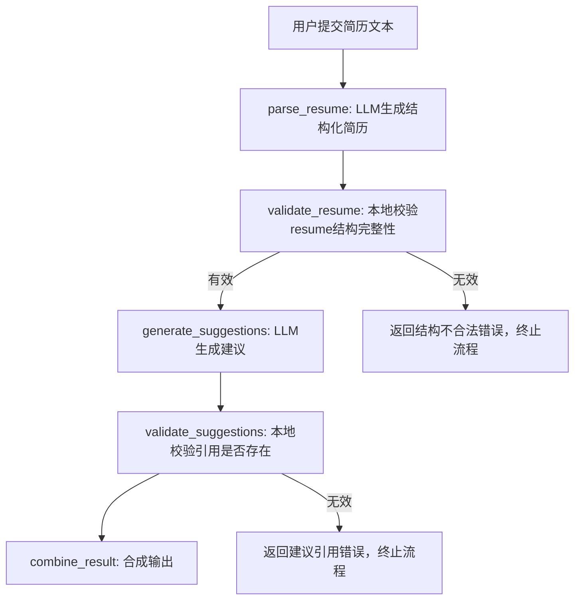

# JobPrep Backend - LangGraph 实现

## 🎯 项目概述

这是一个基于 LangGraph + FastAPI 的简历解析和优化后端系统。系统使用 LangGraph 驱动整个简历解析流程，确保每个步骤都有严格的验证和错误处理。

## 🏗️ 架构设计

### LangGraph 工作流



### 核心组件

1. **LangGraph 工作流** (`src/langgraph/workflow.py`)
   - 5个核心节点：parse_resume, validate_resume, generate_suggestions,
     validate_suggestions, combine_result
   - 2个错误处理节点：handle_resume_error, handle_suggestion_error
   - 完整的状态管理和条件分支

2. **数据模型** (`src/models/resume.py`)
   - Pydantic V2 模型，包含严格的验证规则
   - 支持字段路径解析和动态更新
   - LangGraphState 用于工作流状态管理

3. **API 路由** (`src/routers/`)
   - `/api/parse_resume` - 使用 LangGraph 解析简历
   - `/api/resume` - 获取当前简历 (GET) / 保存完整简历 (POST)
   - `/api/accept_suggestion` - 接受优化建议
   - `/api/chat` - 聊天交互

## 🚀 快速开始

### 安装依赖

```bash
pip install -r requirements.txt
```

### 运行服务

```bash
python src/main.py
```

### 运行测试

```bash
# 运行所有测试
python -m pytest tests/ -v

# 运行特定测试
python -m pytest tests/test_langgraph_workflow.py -v
python -m pytest tests/test_api_integration.py -v
```

## 📋 API 接口

### 解析简历

```bash
POST /api/parse_resume
Content-Type: application/json

{
  "text": "张三\n邮箱: zhangsan@example.com\n教育: 清华大学\n工作: 阿里巴巴"
}
```

### 保存简历

```bash
POST /api/resume
Content-Type: application/json

{
  "resume": {
    "basics": {
      "name": "张三",
      "email": "zhangsan@example.com",
      "phone": "13800138000",
      "location": "北京",
      "summary": "经验丰富的软件工程师"
    },
    "education": [
      {
        "institution": "清华大学",
        "degree": "计算机科学学士",
        "field_of_study": "计算机科学与技术",
        "start_date": "2018-09",
        "end_date": "2022-07",
        "gpa": "3.8/4.0"
      }
    ],
    "work": [
      {
        "company": "阿里巴巴",
        "position": "高级软件工程师",
        "start_date": "2022-08",
        "end_date": "2024-12",
        "description": "负责电商平台后端开发",
        "achievements": [
          "优化系统性能，提升响应速度30%",
          "设计并实现微服务架构"
        ]
      }
    ],
    "skills": [
      {
        "name": "Java",
        "level": "高级",
        "category": "编程语言"
      }
    ],
    "certificates": [
      {
        "name": "AWS认证解决方案架构师",
        "issuer": "Amazon Web Services",
        "date": "2023-06",
        "description": "云架构设计和部署认证"
      }
    ]
  }
}
```

**响应示例：**

```json
{
  "status": "ok"
}
```

**响应示例：**

```json
{
  "resume": {
    "basics": {
      "name": "张三",
      "email": "zhangsan@example.com",
      "phone": "13800138000",
      "location": "北京",
      "summary": "经验丰富的软件工程师"
    },
    "education": [...],
    "work": [...],
    "skills": [...],
    "certificates": [...]
  },
  "suggestions": [
    {
      "field": "work[0].description",
      "current": "负责电商平台后端开发",
      "suggested": "负责阿里巴巴电商平台后端开发，处理高并发订单系统",
      "reason": "添加具体公司名称和更详细的技术描述"
    }
  ]
}
```

### 接受建议

```bash
POST /api/accept_suggestion
Content-Type: application/json

{
  "field": "work[0].description",
  "suggested": "负责阿里巴巴电商平台后端开发，处理高并发订单系统"
}
```

### 聊天交互

```bash
POST /api/chat
Content-Type: application/json

{
  "messages": [
    {"role": "user", "content": "你好，请帮我分析一下我的简历"}
  ],
  "context": {
    "resume": {...}
  }
}
```

## 🧪 测试覆盖

### 分层测试策略

1. **单元测试** (Unit Tests)
   - `test_field_parsing.py` - 字段路径解析 (5个测试)
   - `test_resume_service.py` - 简历服务 (9个测试)
   - `test_chat_service.py` - 聊天服务 (8个测试)

2. **LangGraph 工作流测试** (Workflow Tests)
   - `test_langgraph_workflow.py` - LangGraph 工作流 (10个测试)

3. **集成测试** (Integration Tests)
   - `test_api_integration.py` - API 端点集成 (17个测试)
   - `test_main.py` - 主应用功能 (2个测试)

### 测试统计

总计：52个测试用例，100%通过率

### 测试运行

```bash
# 运行所有测试
python -m pytest tests/ -v

# 运行特定层级测试
python -m pytest tests/test_field_parsing.py -v
python -m pytest tests/test_langgraph_workflow.py -v
python -m pytest tests/test_api_integration.py -v
```

## 🔧 技术栈

- **FastAPI** - 现代、快速的 Web 框架
- **LangGraph** - 状态图工作流引擎
- **Pydantic V2** - 数据验证和序列化
- **Pytest** - 测试框架
- **Mock LLM** - 开发阶段使用模拟数据

## 📁 项目结构

```text
apps/backend/
├── src/
│   ├── langgraph/
│   │   ├── __init__.py
│   │   └── workflow.py          # LangGraph 工作流实现
│   ├── models/
│   │   └── resume.py            # 数据模型定义
│   ├── services/
│   │   ├── resume_service.py    # 简历服务
│   │   └── chat_service.py      # 聊天服务
│   ├── routers/
│   │   ├── resume.py            # 简历相关 API
│   │   └── chat.py              # 聊天相关 API
│   ├── llm/
│   │   ├── client.py            # LLM 客户端
│   │   └── prompts.py           # 提示词模板
│   └── main.py                  # 应用入口
├── tests/
│   ├── test_langgraph_workflow.py  # LangGraph 工作流测试
│   ├── test_api_integration.py     # API 集成测试
│   ├── test_resume_service.py      # 简历服务测试
│   ├── test_chat_service.py        # 聊天服务测试
│   ├── test_field_parsing.py       # 字段解析测试
│   └── test_main.py                # 主应用测试
├── docs/
│   └── langgraph_workflow.md       # 工作流文档
└── requirements.txt
```

## 🎯 核心特性

### 1. 结构化工作流

- 每个步骤职责明确，便于调试和维护
- 错误隔离，不同阶段的错误有独立的处理逻辑
- 完整的状态追踪

### 2. 严格验证

- 简历结构完整性验证
- 建议引用有效性验证
- Pydantic V2 模型验证

### 3. 错误处理

- 详细的错误信息
- 优雅的错误恢复
- 用户友好的错误提示

### 4. 可扩展性

- 模块化设计
- 易于添加新的验证规则
- 支持不同的 LLM 提供商

## 🔮 未来改进

1. **真实 LLM 集成**
   - 替换 Mock 数据为真实的 DashScope 或 OpenAI API
   - 添加 LLM 调用重试和错误处理

2. **持久化存储**
   - 添加数据库支持
   - 用户会话管理

3. **性能优化**
   - 添加缓存机制
   - 异步处理优化

4. **监控和日志**
   - 添加详细的日志记录
   - 性能监控和指标

## �� 许可证

MIT License
