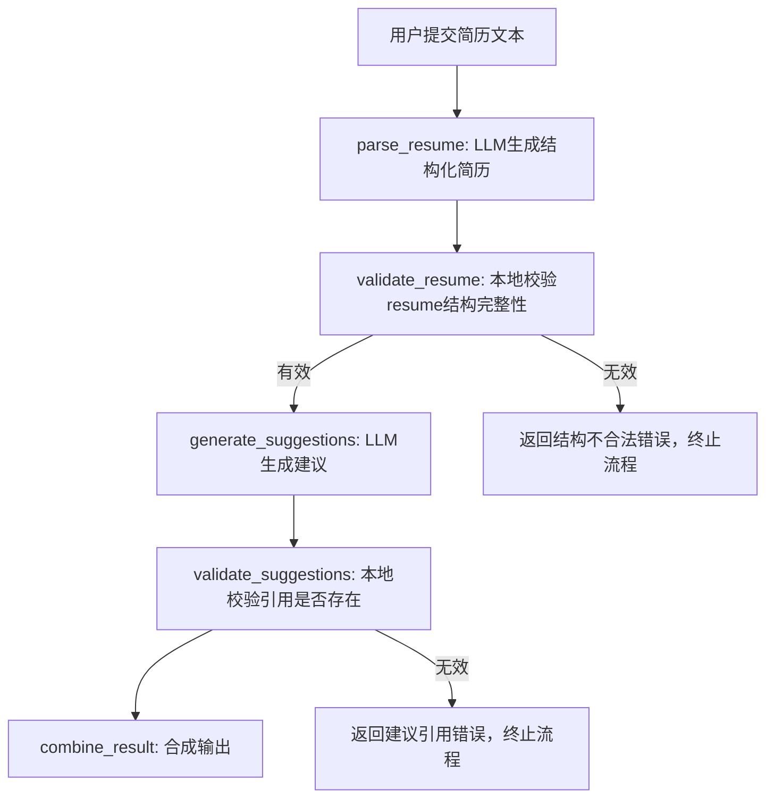

# LangGraph 简历解析工作流

## 工作流程图



## 节点说明

### 1. parse_resume
- **功能**: 使用LLM解析简历文本，生成结构化JSON数据
- **输入**: 原始简历文本
- **输出**: 结构化的Resume对象
- **实现**: 调用LLM API，返回符合Pydantic模型的JSON

### 2. validate_resume
- **功能**: 本地校验简历结构完整性
- **校验规则**:
  - 基本信息必须包含name和email
  - 至少有一项教育经历
  - 至少有一项工作经历
  - 教育经历必须包含institution、degree、field_of_study、start_date
  - 工作经历必须包含company、position、description、start_date
- **输出**: 校验结果，包含错误信息

### 3. generate_suggestions
- **功能**: 基于结构化简历生成优化建议
- **输入**: 验证通过的Resume对象
- **输出**: 建议列表，包含字段路径、当前值、建议值、原因
- **实现**: 调用LLM API生成具体改进建议

### 4. validate_suggestions
- **功能**: 校验建议中引用的字段路径是否存在于简历中
- **校验规则**:
  - 字段路径语法正确（如work[0].description）
  - 引用的字段在简历中确实存在
  - 数组索引在有效范围内
- **输出**: 过滤后的有效建议列表

### 5. combine_result
- **功能**: 合成最终输出结果
- **输入**: 验证通过的Resume对象和建议列表
- **输出**: ParseResumeResponse对象

## 错误处理

### 简历结构错误
- 当validate_resume发现结构问题时，流程跳转到handle_resume_error
- 返回详细的错误信息，说明哪些字段缺失或格式不正确

### 建议引用错误
- 当validate_suggestions发现引用问题时，流程跳转到handle_suggestion_error
- 过滤掉无效建议，只保留引用正确的建议

## 状态管理

工作流使用LangGraphState管理整个流程的状态：

```python
class LangGraphState(BaseModel):
    resume_text: str                    # 原始简历文本
    parsed_resume: Optional[Resume]     # 解析后的简历对象
    suggestions: List[Suggestion]       # 生成的建议列表
    validation_errors: List[str]        # 验证错误信息
    final_result: Optional[ParseResumeResponse]  # 最终结果
    error_message: Optional[str]        # 错误信息
```

## 条件分支

工作流使用条件边来决定下一步：

1. **validate_resume后**: 根据validation_errors是否为空决定继续或错误处理
2. **validate_suggestions后**: 根据validation_errors是否为空决定继续或错误处理

## 优势

1. **结构化流程**: 每个步骤职责明确，便于调试和维护
2. **错误隔离**: 不同阶段的错误有独立的处理逻辑
3. **可扩展性**: 可以轻松添加新的验证规则或处理步骤
4. **状态追踪**: 完整的状态管理，便于监控和调试
5. **测试友好**: 每个节点可以独立测试 