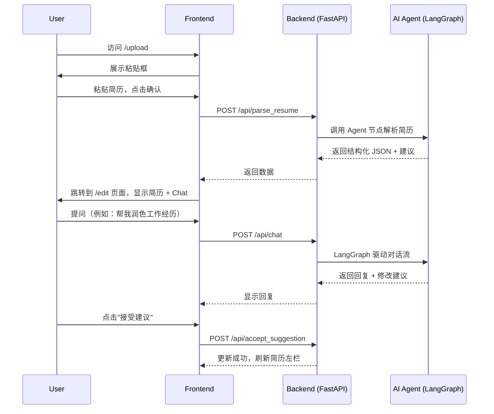

# 用户简历完善系统：前端 UI、后端 API 与交互设计文档

## 一、整体功能流程概览

用户旅程包括两个阶段：

1. **简历上传与结构化展示**
2. **AI 驱动的交互式完善流程**（基于 Chat）

---

## 二、前端 UI 设计

### 页面 1：简历上传页面 `/upload`

**展示内容：**

- 页面标题："开始完善你的求职档案"
- 文本框（支持 Markdown / TXT 粘贴）
- 按钮："确认并分析"

**用户操作：**

- 粘贴简历内容 → 点击确认 → 前端调用 `/api/parse_resume` → 成功后跳转到 `/edit`

---

### 页面 2：结构化编辑与 Chat 页面 `/edit`

页面分为左右两栏：

#### 左侧：结构化简历展示（组件：`<ResumePanel />`）

**分区：** 基本信息 / 教育经历 / 工作经历 / 技能 / 证书

**每个区域展示：**

- 用户提供的信息
- AI 给出的改进建议（可展开）
- 接受建议按钮 → 修改原始内容

#### 右侧：Chat 窗口（组件：`<ChatPanel />`）

**支持：**

- 聊天记录流
- 引用结构化内容（点选引用 + 插入气泡）
- 用户自由输入问题
- 回复建议中包含"接受此建议"按钮（点击后将自动修改简历字段）

---

## 三、后端 API 设计

### 1. POST `/api/parse_resume`

解析用户粘贴的文本，生成结构化简历 JSON，并附带建议。

**Request:**

```json
{
  "raw_resume_text": "string"
}
```

**Response:**

```json
{
  "resume": {
    "basics": { "name": "...", "email": "..." },
    "education": [...],
    "work": [...],
    "skills": [...],
    "certificates": [...]
  },
  "suggestions": {
    "work[0]": ["可补充项目成就", "可加上量化指标"],
    "skills": ["建议加上Python、SQL"]
  }
}
```

### 2. POST `/api/chat`

AI Agent 驱动的主交互接口，LangGraph 状态管理。

**Request:**

```json
{
  "messages": [
    { "role": "user", "content": "帮我改进我的教育经历" },
    { "role": "assistant", "content": "你目前填写的是..." }
  ],
  "context": {
    "resume": { ... },
    "suggestions": { ... }
  },
  "referenced_keys": ["education[0]"]
}
```

**Response:**

```json
{
  "reply": "你可以考虑增加GPA和课程信息。是否需要我帮你起草？",
  "action": {
    "type": "suggest_update",
    "field": "education[0]",
    "suggested": "加上 GPA: 3.9/4.0；主修课程：算法、数据结构、机器学习"
  }
}
```

### 3. POST `/api/accept_suggestion`

用户接受某条建议并更新结构化简历。

**Request:**

```json
{
  "field": "work[1]",
  "new_value": "负责AI平台开发，提升自动化率30%"
}
```

**Response:**

```json
{ "status": "ok" }
```

---

## 四、前后端交互流程图（初次进入 + Chat 完善）



---

## 五、补充说明

- **前端技术栈：** Next.js + Tailwind CSS + shadcn/ui + Zustand 管理状态
- **后端运行在 Render.com，** 暂不持久化，简历数据保存在 session/memory
- **推荐使用 ChromaDB** 存储每条 JD 与简历的向量匹配（后续阶段）
- **Chat 可以通过@引用** 结构化内容字段，LangGraph 自动解析 context
